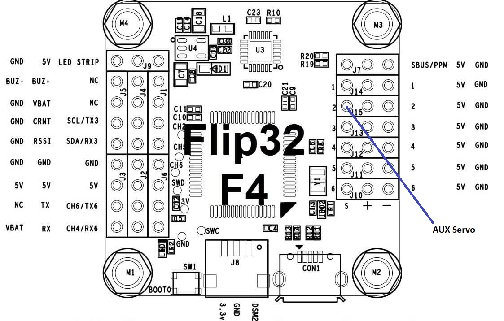

# AUX channel

The controller supports an AUX servo output. If an input channel is mapped to the AUX function, then the RC sender can control this function. The idea for that was primarily for a braking servo. At speed near zero a button is flipped and then a mechanical brake would be engaged. 

But actually, this AUX channel can be used for many things, control a camera focus motor,...

## Hardware

#### MCU Pins used

| Function | MCU Pin | MCU Function | Connector Pin | Flip32 F4  |
| -------- | ------- | ------------ | ------------- | ---------- |
| Servo 2  | PB1     | TIM3_CH4     | Servo2        | Servo2/J15 |

#### Pinout

## Assoziated commands

| Command                                              | Allowed values           | Description                          |
| ---------------------------------------------------- | ------------------------ | ------------------------------------ |
| \$j a                                                |                          | Print the current mapping            |
| \$j a \<channel #\>                                  | 1...16 or 256 to unmap   | Set the channel for AUX              |
| \$A                                                  |                          | print the current AUX output timings |
| \$A \<neutral\> \<neutral range\> \<max deflection\> | integers of microseconds | Set the AUX output timings           |

## Settings

First step is to assign an input channel to this function: \$j a \<channel #\>

For example \$j a 14 would set the channel #14 of the RC sender to be used as input. If this channel is at neutral, the AUX output would be neutral, putting it to max would output the max allowed puls width for the servo.

Because this AUX channel might have a different neutral range, this can be configured by the command \$A. For example \$A 1500 5 695 would set the neutral point to 1500, the neutral range to 5 and allow a max deflection of 695. In other words, neutral is 1500us, max is 1500+5+695=2200us, min is 1500-5-695=800us puls lengths.