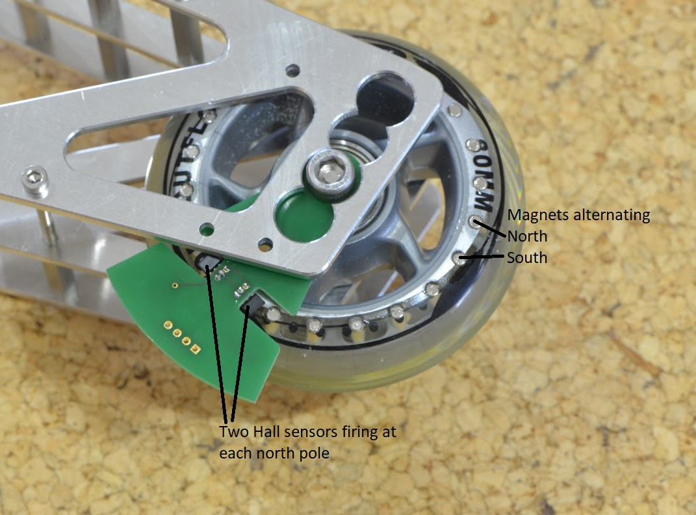
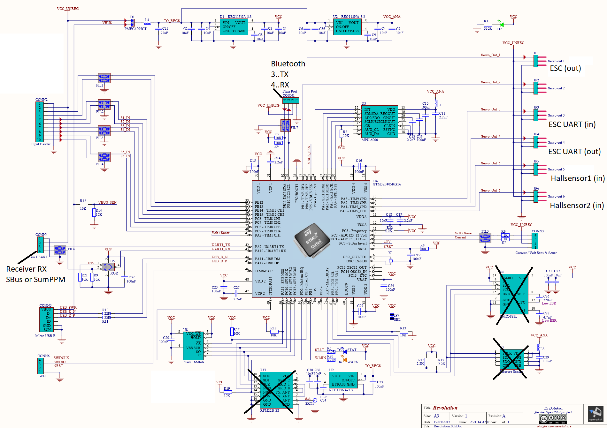
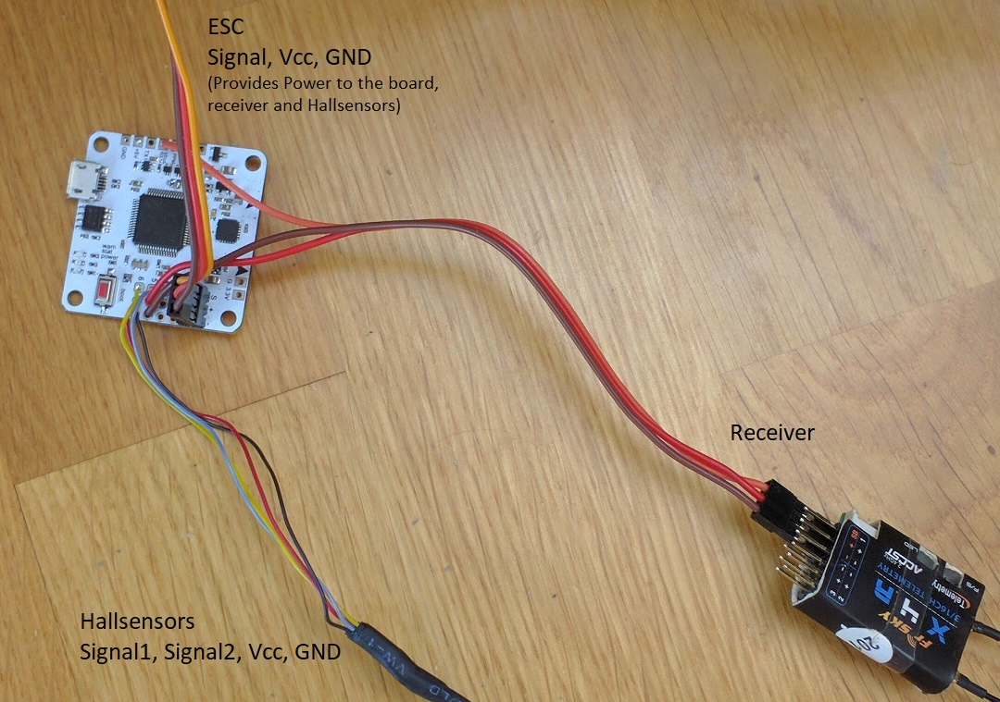
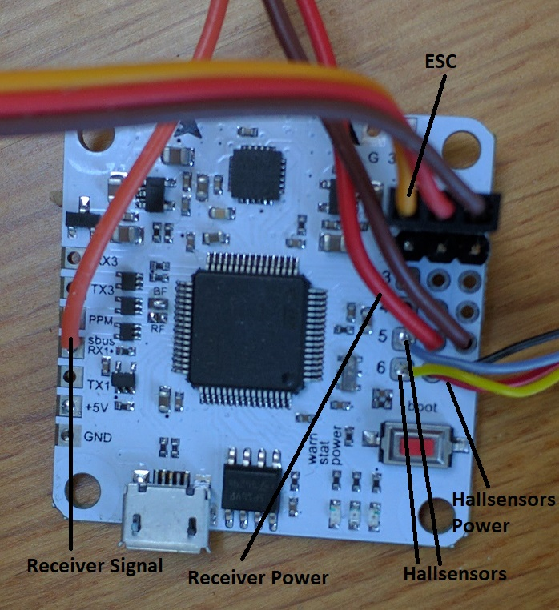
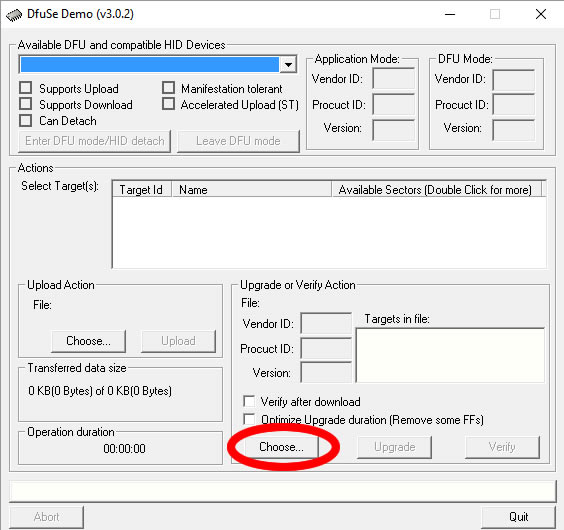
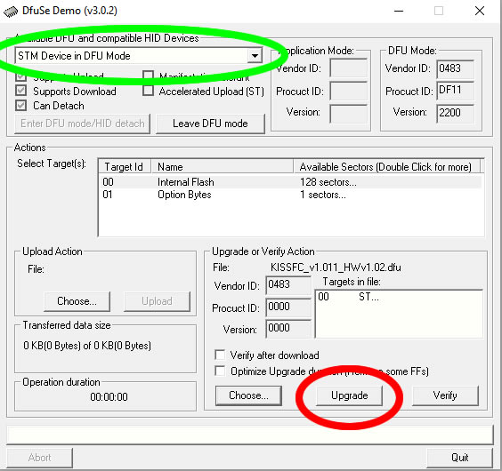
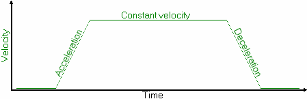

## Goals

The most simple way to control a cablecam is by connecting the RC receiver to the motor controller (=ESC, speed controller) and control it like a RC car.
But this has multiple limitations the CableCam Controller tries to solve:
1. The CableCam might crash into the start- or endpoint by accident. Would be much nicer if the CableCam calculates the required braking distance constantly and does engage the brake automatically. This way it stops automatically no matter of the user input.
1. A smooth acceleration/deceleration makes the videos look better. Even when the stick is pushed forward at once, the CableCam should accelerate slowly instead of the wheel slipping over the rope.
1. A speed limiter to protect the CableCam from going too fast and for constant speed travels during filming.
1. Direct positional control. Normally the stick controls the thrust. But the thrust might mean different things, e.g. a thrust of zero could make the CableCam accelerate downhill. The stick of the RC sender should rather control the speed - stick in neutral means the CableCam should stop.
1. Preprogram movement patterns and the Cablecam repeats them on request.

To achieve that the CableCam controller sits between the receiver and the motor controller and acts as a governour of the receiver input. If for example the user did push the stick forward from neutral to max within a second, the CableCam Controller rather increases the stick position slowly. For speed and positional input the controller is connected to two hall sensors on one of the running wheels.

## Getting started

### Hardware

Instead of using a custom build PCB, the project is based on easy to get hardware but flashed with a new firmware. 
This PCB should be small, have an onboard power regulator suited for RC-receiver typical voltages, servo connectors for power in and ESC output. It should also be based on a STM32F4 chip for easier flashing of the firmware - no bootloader needed - and include the needed hardware inverter for SBus signals. The Flight Controllers developed for Copters are an obvious choice.
In particular the [CC3D Revolution board](http://opwiki.readthedocs.io/en/latest/user_manual/revo/revo.html) is a perfect match. The only drawback of the CC3D Revo is that it contains additional hardware like a magnetometer, a barometric height sensor and an expensive RF link - nothing useful for a CableCam. But luckily there a clones of this board without these components, making the board cheaper as well.

_Note: The STM32F4 allows very flexible remapping of the pins to different functions, hence what is supposed to be used as output in the CC3D Revo firmware is rather used as input with the CableCam Controller firmware occasionally._

As said, the board is put between the ESC and the receiver and gets the positional input from the hall sensors in addition.

The board can be powered via two methods, either via USB or via one of the Vcc_unreg pins on the Servo connectors. The USB power is applied to the board electronics only, hence is useful for flashing and configuration but not for powering the receiver. Also USB does not provide enough amps for the receiver. That is the reason the receiver and the hall sensors are not powered by the +5V pin but via the Servo out pins.
As the hall sensor is connected to Servo5 and Servo6 (order does not matter - can be swapped in the firmware) but needs Vcc and Gnd just once, the Reciver power cables are soldered to Servo5 Vcc and Gnd.
In other words, as in the normal case the ESC provides power to the receiver, just not directly but with the CC3D Revo board inbetween and hence powering it and all other external components as well.

_Note: All types of receivers are connected to the SBus/RX1 pin. The PPM pin is not used yet, not even for PPM receivers. The main reason is to make sure only one receiver can be connected._

#### Hall sensor

The hall sensor is very simple. The [Allegro Microsystems A1120](http://www.allegromicro.com/en/Products/Magnetic-Digital-Position-Sensor-ICs/Hall-Effect-Unipolar-Switches/A1120-1-2-5.aspx) sensor connects the output to Gnd if the magnetic field perpenticular to the chip surface exceeds a certain level and opens that switch if it falls below a level (=Open Drain). These two levels are different, hence avoiding noise in case the magnet field is exaclty at the switch level (=Hysteresis). As a result the sensor board can be very simple. Power between 3..24V is provided - hence perfectly suited for the Vcc_unreg provided by the ESC - and a capacitor nearby the chips is needed. The output signal of both is connected directly to the Servo5&6. A pullup resistor is not needed either, the STM32 MCU internal ones are turned on for those two pins.

The only important things to make sure are
1. The hall sensor does switch on and off reliably, meaning the magnetic field has to raise above and fall below the thresholds for sure.
1. The two hall sensors have a delay between switching on/off as this delay tells the rotation direction. If both would switch on exactly the same time, no rotation direction can be derived.

To achieve that one of the running wheels has 22 bores of d3x8mm (3mm drill and 8mm deep) and magnets are inserted alternating north/south. The hall sensor does switch on north magnetic fields only and therefore by adding a south orientated magnet between, it is an absolute certainty, the north field strength falls below the required level. 
In my case the bores are drilled into the skate wheel with a diameter of 60mm, hence the distance between each drill is 8.6mm. So as long as the distance between the two hall sensors is not 17.2mm or multiples thereof, they will not switch on/off at the same time. I aimed for a distance of 8.6mm+50% = 13mm roughly.

_Note: The sensor board PCB is currently redesigned using above guidelines. Maybe LEDs are added as well as visual indication?_

### Flashing the firmware

One of the advantages of using a STM32F4 is that flashing got much more simple. No additional hardware is needed, no bootloader to be flashed first. The STM32F4 has an USB bootloader onboard already. All that is required is to have the boot button on the board pressed while powering it, and the bootloader is active. 
Then the ST provided DfuSe program is used to upload the firmware provided as _.dfu_ file in the bin folder of this project.
That's about it. In more detail, the steps are shown below.

_Note: All drivers used are included in a standard Windows 10 installation._
1. Install the ST provided DfuSe utility from the bottom of [this page](http://www.st.com/en/development-tools/stsw-stm32080.html).
1. Run the installed DfuSe program.
1. Connect the board to your computer via USB and while doing so, keep the boot button pressed. When the board is powered with the boot button pressed, the STM32 internal USB bootloader is started instead of the firmware.
1. As this activates the STM32F4 hardware bootloader and no firmware runs, only the red Power LED should be on. If the green Status LED does blink, the firmware is active. Try again above step.
1. Download the firmware from this project https://github.com/wernerdaehn/CC3D-CableCam-Controller/blob/master/bin/Debug/CableCamControllerF4.dfu
1. At the bottom of the utility, in the _Upgrade or Verify Action_ area, click on _Choose_ and select above's downloaded CableCamControllerF4.dfu file. 
 
1. The DfuSe Utility should show in the top box the text _STM Device in DFU Mode_. This indicates the board's hardware bootloader is running. 
1. If it does, the _Upgrade_ button copies the firmware onto the board. 
 
1. The next dialog(s) is to be confirmed with _yes_. We are certain the firmware is for the STM32F405RG chip.
1. To validate the flashing truly was successful, the _Verify_ action can be triggered, just to doublecheck.
1. At the top, the button _Leave DFU mode_, does restart the device and as the boot button on the board is not pressed during startup, it will boot the firmware.
1. A first indication that everything is normal is when the yellow Status LED on the board does flash with 1Hz.

### Initial Setup and command reference

When the board is connected with a USB cable, a new virtual com port is created and commands can be sent to the board using a serial terminal.
Everything can be configured via commands and the current settings and states be read as well.
The format to enter commands is to start with a _$_ sign, followed by the program character, optional parameters and a final \r and/or \n char.
For example $h follwoed by the return key would print the help text.

The first thing to do is selecting the RC receiver type, SBus (1) or SumPPM (0..default). So enter the command _$I_ to see the current setting and _$I 1_ to switch it to SBus.
Using the command $1 invokes a guided setup of the input channels and hte neutral range with many sanity checks. Make sure the RC sender does output something on the desired switches and no mixers are enabled.

### Bluetooth
To simplify using the controller all settings can be done via bluetooth as well. It assumes the bluetooth module is connected to RX3/TX3 of the CC3D Revo and runs at 38400,8,n,1. In case the module is a HC-05, using the command _$B_ does everything to setup the module correctly, figureing out the current baud rate, changing it, give the module the name _cablecam_ and set the security Pin to 1234. 

### Command Reference

Command | Description
------- | -----------
_$1_ | Guided setup through for the receiver once _$I_ was used to select the receiver type. This command sets the same values as _$i_ and _$n_ does.
_$a_ | Shows the two acceleration values, the first is the max acceleration in operational mode, the second in programming mode
_$a int int_ | sets the two acceleration values. Default is _$a 20 10_
_$B_ | Configure the HC-05 bluetooth module connected to RX3/TX3 pin
_$e_ | Print the maximum eRPMs as defined in the VESC ESC.
_$e int_ | Set the maximum eRPMs as defined in the VESC ESC.
_$g_ | Print the maximum positional error before going into an emergency brake. In case moving the stick slowly towards neutral does not apply enough brake power and hence the endpoint will be overshot by more than this value, the ESC output is reset to neutral forcefully. Thus applying the maximum brake power the ESC can apply. Default is 100 Hall sensor steps.
_$g int_ | Set the max error.
_$i_ | Print the the current channel assignments and a overview of all channels with their current values as received from the RC receiver. A value of 0 means no valid data received.
_$i int int int int int int int_ | Assign the input channels to functions in the order of speed, programming switch, endpoint button, max acceleration dial, max speed dial, mode selector, Aux Channel input. A value of 256 is allowed in order to disable those RC functions.
_$I_ | shows which type of receiver signal is expected
_$I 0_ | SumPPM receiver. Note: Changing it requires the setting to be written with $w and to reboot the board.
_$I 1_ | SBus receiver. Note: Changing it requires the setting to be written with $w and to reboot the board.
_$m_ | print the operation mode
_$m 0_ | Positional mode. In this mode the stick moves a target position and a PID loop does everything in order to keep the CableCam as close as possible to that point. ATTENTION: Not tested, do not use.
_$m 1_ | Passthrough mode. Essentially output = input. All the control does is converting the receiver signal into an ESC servo output signal. Useful for testing and to calibrate the ESC for neutral/max/min points.
_$m 2_ | Passthrough with speed limits. The stick movements is filtered through the acceleration and speed filter, thus being turned into a ramp. Enpoints are not considered.
_$m 3_ | Passthough with speed limits & end points. In addition to the _$m 2_ mode, the end points are considered as well. The default mode, the mode that should be used all the time.
_$n_ | Prints the neutral point of the input, the neutral range and the 100% range. Make sure that the neutral point is the same value _$i_ shows for the speed channel when the RC stick is in idle.
_$n int int int_ | set the neutral point to the first value and the neutral range to the second. The third value is the maximum deflection from neutral. The default value of _$n 992 30 800_ would consider all stick values from 962 to 1022 as idle and values from 162 to 1762 as thrust.
_$N_ | Prints the neutral point and range of the ESC output pwm signal. 
_$N int int_ | sets the neutral point and range. The default _$N 1500 30_ creates a pwm signal with a puls width of 1500us in idle and to create movement overcomes the neutral range of the ESC by starting with 1530 (or 1470 for reverse). This should match the defaults of the ESC but ESC calibration is adviced. The better these values match the ESC, the faster the response times at start.
_$p_ | Print the low endpoint, the high endpoint and the current position. 
_$r_ | Print the rotation direction, clockwise (+1) or ccw (-1). This is important information one the cablecam did overshoot the endpoint. Then the controller allows driving back into the allowed range but not further outside. But which direction 
_$r int_ | Sets the rotation direction.
_$S_ | Print a summary of all settings.
_$v_ | Print the max value the speed input signal is allowed range between the neutral point. With the neutral point at 992 and a speed limit of 800, the full SBus range of 192 to 1792 can be used. With a value of 400, everything above 50% thrust on the stick is limited to 50% max thrust. Note that this value controls the stick and hence is dependant on the type of input receiver.
_$v int int_ | Sets the max speed for the operational mode and the programming mode. The idea is to limit the max speed when setting the endpoints as a safety precaution. Default is _$v 500 100_.
_$w_ | Write all active settings to the EEPROM from which they are loaded at boot time. Active settings does include everything, even the start/end points.
_$x_ | Print the exponential factor for the thrust stick input.
_$x double_ | Set the exponential factor for the thrust input curve. A common input curve is a linear relationship between the stick position and the output signal. 100% stick means 100% output, 50% stick is 50% ouput signal. This behavior would require the factor to be set to 1.0. If the stick can send signals in 0.1% steps and the maximum RPMs are 50'000, the lowest possible resolution would be in 50RPM steps. Which is absolutely fine at higher speeds but at low speeds it does not allow fine control. The closer this factor is to zero, the fine grained low speeds can be controlled.

Just to repeat: Every setting starting with _$1_ and below has no effect, except for the positional mode _$m 0_. And this mode should not be used for now.

### The acceleration and speed limiter

When driving an RC car, applying full thrust instantly is fun, as the wheels start spinning, dirt flying through the air. For the CableCam not so much. Here a constant acceleration is more important. Therefore the CableCam Controller has in ramp built in.
As long as th user stay within the acceleration and speed limit, he has full control. But if he exceeds the acceleration by e.g. pushing the stick forward too quickly, the stick movement is limited to the maximum allowed acceleration. 

### Endpoint limiter

Using the programming switch the CableCam can be brought into a mode where the enpoints are set. Driving the CableCam to the startpoint and pressing the end point switch makes the current position the start point limit. The driving forward or reverse to the end point and pressing the end point switch a second time, set this as the second limit. 
When the programming switch on the RC sender is put back into the operational mode, the CableCam can be driven only within those two points.

To change the end points, the programming mode is entered again and the CableCam allows driving to any position, even outside of the previous set range. The sequence is always the same, first click after entering the programming mode sets the first point, all subsequent clicks modifes the second end point.

The logic for the end point limiter is a bit tricky. 
Based on the stick position and the acceleration limit, the time to zero is calculated. For example, if the stick is at position +100 and the acceleration is 20, it takes 100/(20*0.1)=50 cycles to reach zero. At a refresh rate of 20ms, 50 cycles are 50*20ms, that is one second. In other words, the cable cam should stop within one second.
From the hall sensor the controller knows the current speed, the time to stop from the stick level, hence the distance to stop can be calculated: s = v * t / 2 [(velocity-time graph)](http://www.bbc.co.uk/education/guides/z3bqtfr/revision/5).

This calculation is made in absolute numbers to simplify things and which end point should be considered depends to the stick position only. If the stick is in forward direction, the current position plus the braking distance needs to be smaller than the end point. If the stick is in reverse, the position minus the braking distance has to be larger than the start point.
As soon as the calculation shows the end point will be overshot, the stick is moved towards the neutral position usng the max acceleration.
For a closed loop ESC this would cause the motor to actively engage the brake until the reduced target speed has been achieved. 
A regular car ESC does slow down less. Almost nothing in fact. The drag brake does kick in if the stick is in neutral only. 
Therefore a second test is performed, checking if the end point would be overshot by more than 100 steps - about 1m. If yes, although the stick value is constantly removed, the ESC signal is reset to neutral to engage the drag brake. 
That is the best the controller can do.
And as a second precaution, as soon as the end point was overshot, the stick is forced into neutral, causing the CableCam to stop as quickly as possible.

## Detailed Usage

## Development

### Hardware Mapping

Connector Pin | Description | MCU Pin | MCU function
------------- | ----------- | ------- | ------------
Servo1 | Servo Output to the ESC; Connect the ESC to it in order to feed it with valid PPM servo signals | PB0 | TIM3_CH3
Servo2 | Servo Output for Aux Input | PB1 | TIM3_CH4 
Servo3 | ESC Output via UART | PA3 | USART2_RX
Servo4 | ESC Output via UART | PA2 | USART2_TX
Servo5 | 32Bit Quadruple Encoder used for Hall Sensor input | PA0 | TIM5_CH1
Servo6 | 32Bit Quadruple Encoder used for Hall Sensor input | PA1 | TIM5_CH2
LED Status | Status LED on the boards (Low = On) | PB5 | GPIO
LED Warn | Warn LED on the board (Low = On) | PB4 | GPIO
MainUSART | Receiver input; In SBus Mode | PA10 | USART1_RX
MainUSART | Receiver input; In SumPPM Mode | PA10 | TIM1_CH3
IMU | SPI for MPU-6000 IMU | PA4 | SPI1_NSS
IMU | SPI for MPU-6000 IMU | PA5 | SPI1_SCK
IMU | SPI for MPU-6000 IMU | PA6 | SPI1_MISO
IMU | SPI for MPU-6000 IMU | PA7 | SPI1_MOSI
EEPROM | SPI for Flash 16MBit and optional RF Module (not used) | PA15 | SPI3_NSS
EEPROM | SPI for Flash 16MBit and optional RF Module (not used) | PC10 | SPI3_SCK
EEPROM | SPI for Flash 16MBit and optional RF Module (not used) | PC11 | SPI3_MISO
EEPROM | SPI for Flash 16MBit and optional RF Module (not used) | PC12 | SPI3_MOSI
EEPROM | Select for Flash 16MBit | PB3 | GPIO
Bluetooth | TX3 on Flexiport | PB10 | USART3_TX
Bluetooth | RX3 on Flexiport | PB11 | USART3_RX
