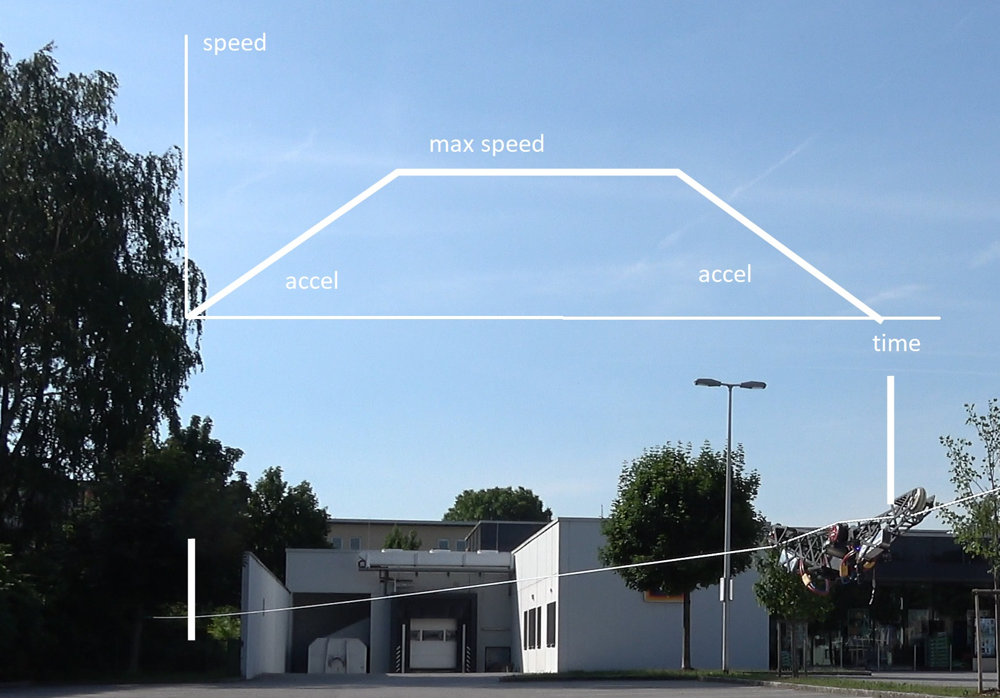

[LICENSE](LICENSE)

# CableCam-Controller

**A CableCam Controller to allow smooth movements and automatic braking near the end points of the rope.**

## Goals

The most simple way to control a cablecam is by connecting the RC receiver to the motor controller (=ESC, electronic speed controller) and control it like a RC car.
But this has multiple limitations this CableCam Controller tries to solve:

1. The CableCam might crash into the start- or endpoint by accident. Would be much nicer if the CableCam calculates the required braking distance constantly and does engage the brake automatically. This way it stops no matter of the user input.
2. A smooth acceleration/deceleration makes the videos look more cinematic. Even when the stick is pushed forward at once, the CableCam should accelerate slowly instead of the wheel spinning damaging the rope.
3. A speed limiter to protect the CableCam from going too fast and for constant speed travels during filming.
4. Preprogram movement patterns and the Cablecam repeats them on request.

To achieve that, the CableCam controller sits between the receiver and the motor controller and acts as a governour of the receiver input. If, for example, the user did push the stick forward from neutral to max within a second, the CableCam Controller rather increases the stick position slowly. For speed and positional input the controller is connected to two hall sensors on one of the running wheels.

MCU used is [STM32F405RG](http://www.st.com/en/microcontrollers/stm32f405rg.html) 
Board used: Any CC3D Revolution or clone, e.g. the [Flip 32 F4](https://github.com/iNavFlight/inav/blob/master/docs/Board%20-%20Airbot%20F4%20and%20Flip32%20F4.md) which can be bought at various shops for little money [(here?)](https://www.rctech.de/flip32-f4-flight-controller.html).

See all videos at: https://www.youtube.com/channel/UCTLw_Boy24qAhuygCyIOzyw 

If the stick is pushed full forward, the cablecam will start accelerating with the maximum allowed value instead until the maximum allowed speed is reached. This speed is held until it starts to decelerate with the same acceleration level so that it reaches the end point at zero speed.

Using the speed dial the maximum speed can be configured. And with the accel dial the steepness of the linear acceleration curve.

## Setup

1. [Flashing the Firmware](docs/Step%201%20-%20Flashing%20the%20Firmware.md)
2. [Connecting the board](docs/Step%202%20-%20Connect%20to%20the%20board.md) to the computer for first tests and settings
3. Choosing the receiver
   1. [SBus](docs/Step%203a%20-%20Receiver%20Input%20SBus.md)
   2. [SumPPM](docs/Step%203b%20-%20Receiver%20Input%20SumPPM.md)
4. [Assigning input channels](docs/Step%203b%20-%20Receiver%20Input%20SumPPM.md)
5. Connecting the motor controller (ESC)
   1. Using a [servo signal to control the ESC](docs/Step%205a%20-%20Regular%20ESC.md)
   2. Using the [VESC6 as motor controller](docs/Step%205b%20-%20VESC%20as%20motor%20controller.md)
6. [Connecting the position sensor](docs/Step%206%20-%20Connecting%20the%20Position%20Sensor.md)
7. [Limiters](docs/Step%207%20-%20Limiters.md)
8. [Endpoints](docs/Step%208%20-%20Endpoints.md)
9. [Aux Channel](docs/Step%209%20-%20Aux%20channel.md) (optional)
10. [Bluetooth](docs/Step%2010%20-%20Bluetooth.md) (optional)
11. [Play Function](docs/Step%2011%20-%20Play.md) (optional)

