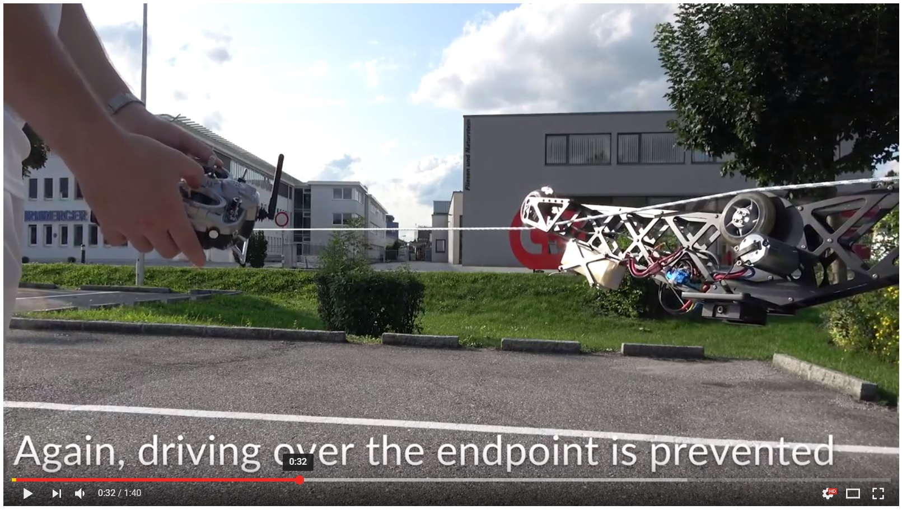
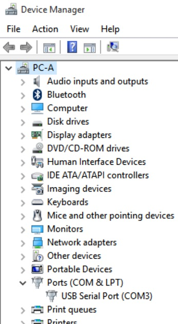
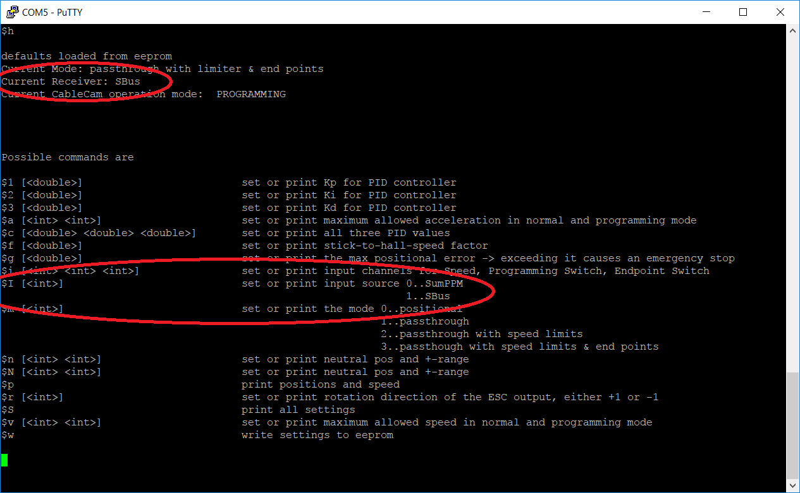
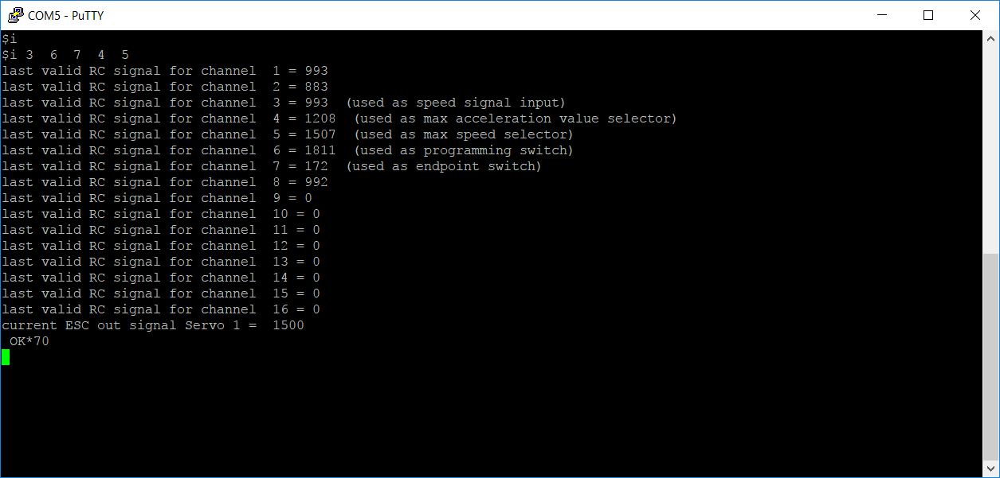
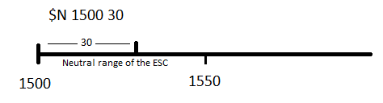

[LICENSE](LICENSE)

# CC3D-CableCam-Controller

**A CableCam Controller to allow smooth movements and automatic braking near the end points of the rope.**

MCU used is [STM32F405RG](http://www.st.com/en/microcontrollers/stm32f405rg.html)  
Board used: Any CC3D Revolution or clone, e.g. F4 Advanced Flight Controller by Bob Forooghi [e.g. bought here](http://www.getfpv.com/f4-advanced-flight-controller.html)

https://www.youtube.com/watch?v=M1JVqWaG6Yg

## (Quick)start

**Hardware**
1. Connect the ESC to the Servo1 pins. The ESC will power the board. ESC should be turned off for now.
1. Connect the receiver (SumPPM or SBus) to the Main USART, the pin called SBus RX1 on above F4 controller
1. Provide power to the receiver by connecting its Vcc and Gnd to Servo5 Vcc and Gnd
1. Hall sensor board is powered by Servo6 Vcc and Gnd and its two input signals are connected to Servo5 and Servo6 signal pins

**Flashing the firmware**

_Note: All drivers used are included in a standard Windows 10 installation._
1. Install the ST provided DfuSe utility from the bottom of [this page](http://www.st.com/en/development-tools/stsw-stm32080.html).
1. Run the installed DfuSe program.
1. Connect the board to your computer via USB and while doing so, keep the boot button pressed. When the board is powered with the boot button pressed, the STM32 internal USB bootloader is started instead of the firmware.
1. As this activates the STM32F4 hardware bootloader and no firmware runs, only the red Power LED should be on. If the green Status LED does blink, the firmware is active. Try again above step.
1. Download the firmware from this project https://github.com/wernerdaehn/CC3D-CableCam-Controller/blob/master/bin/Debug/CableCamControllerF4.dfu
1. At the bottom of the utility, in the _Upgrade or Verify Action_ area, click on _Choose_ and select above's downloaded CableCamControllerF4.dfu file. 
 
1. The DfuSe Utility should show in the top box the text _STM Device in DFU Mode_. This indicates the board's hardware bootloader is running. 
1. If it does, the _Upgrade_ button copies the firmware onto the board. 
 
1. The next dialog(s) is to be confirmed with _yes_. We are certain the firmware is for the STM32F405RG chip.
1. To validate the flashing truly was successful, the _Verify_ action can be triggered, just to doublecheck.
1. At the top, the button _Leave DFU mode_, does restart the device and as the boot button on the board is not pressed during startup, it will boot the firmware.
1. A first indication that everything is normal is when the yellow Status LED on the board does flash with 1Hz.

**First setup**

1. Currently the board is powered by USB, as the **ESC is off still**. Hence neither the receiver nor the hall sensors work.
1. As the board is connected to the computer via USB a new COM port is available to interact with the CableCam Controller.
1. Validate that by starting the Windows 10 Device Manager and locating the port. 
 
1. Open a serial terminal in order to talk to the board. The one I use is [putty](https://www.chiark.greenend.org.uk/~sgtatham/putty/latest.html) as 64Bit install or just the 64Bit exe download.
1. In the terminal create a new serial connection to the port shown in the devide manager. In putty that means clicking on _serial_ and entering the port like _COM3_. The settings for baud rate etc are irrelevant and can be left the defaults.
1. To test if everything works properly, a first command can be sent by typing _$h_ for help and confirming the command with the return key.
1. This should print status information plus a help text in the console.
 
1. The first and most important step is to set the type of receiver. The firmware supports either SBus or SumPPM. The $h command prints the currently active receiver type and using the _$I_ (uppercase "i") the input receiver type can be changed, e.g. from the default SumPPM to SBus via _$I 1_. Then store that value permanently using the _$w_ command and restart the board by disconnecting the USB cable and reconnecting.
1. Next step is to validate the receiver input signals. Turn on the ESC (CC3D Revo is designed to handle USB and external power at the same time) to power the receiver and enter the command _$i_. This shows all channels, their current reading from the receiver and which channel is used for what function.
 
1. Setup the RC sender to assign the various inputs to channels. The functions used are
    1. Speed Input: In my case I control the camera with the left stick, moving the right stick forward/backwards should move the CableCam. This is channel 3 on my sender.
    1. Programming Switch: In order to set endpoints, a switch on the RC is flipped. This does enter or leave the end point programming mode. In my case the RC sender Switch SF is mapped to channel 6. 
    1. Endpoint Button: When pressing the button the first time, this will be the endpoint no.1, then the CableCam will be driven to the second endpoint and pressing the button a second time set that position as endpoint no.2. After leaving the programming mode, the CableCam can be driven only within these two points. I use button SH for that, mapped to channel 7.
    1. max acceleration knob (optional): The CableCam Controller puts a filter over the Speed Input to allow for slow accelerations/deaccelerations only. The value of this can either be programmed using the _$a_ command or by the sender. In my case the knob S1 is programmed to control the channel 4. A value of 256 would deactivate this function.
    1. max speed knob (optional): Similar to the acceleration, the maximum speed can be set as well. Either by the command _$v_ or via the RC sender, here the S2 is assigned to channel 5.
1. To validate each channel execute the command _$i_ multiple times and check which channel reading does change when operating the RC sender.
1. Run the command $1 for a guided setup of the channels to CCC functions.
1. Validate with _$i_ the current assignment.
1. With _$w_ these settings are stored permantly. 
1. Apply speed via the RC sender and check if the motor starts. If it does not, the defaults for other settings in the controller do not match your setup and need to be tested - see the troubleshooting section below.
1. Execute the command _$p_. This prints out the current two end points and the current position. When the wheel with the Hall Sensor is turning, the position reading should be different with each _$p_ call. This does proof the Hall sensors are working properly.

**ESC setup**

Program the RC car ESC to forward/reverse and high levels of drag and initial brakes. This is essential for the CableCam controller to work. The CableCam Controller only moves the stick forward, neutral or reverse but does not apply extra power to hold against the movement of the CableCam!

This is worth some explanations:
At first sight the CableCam is like a RC car. Drving forward, backward and stop. One main difference however is that the CableCam should drive forward and backward in an identical fashion. Many car ESCs do not support that. With those you can accelerate the car forward, putting the stick in neutral lets the car free wheeling and to brake it actively, the stick has to be put into reverse until it stops. And only then you can go in reverse direction, probably at reduced speed.
With the CableCam we want something else. Putting the stick forward drives the CableCam in one direction, neutral means stopping and reverse means driving in reverse direction at same speed as forward.
ESCs that support that are used for rock crawlers and usually name that application specifically. Another indication the ESC supports all the CableCam application needs is when there is a drive mode forward/reverse, a drag brake setting and an intial brake setting is available. 
The drag brake level means how decisive the car brakes when the stick is in neutral while moving. A drag brake of zero would let the car continue to drive, slowed down only by resistance. A high drag brake means the ESC does use regenerative braking and removes kinetic energy from the car, thus stopping it more quickly.
The initial brake level controls if the motor should be energized a little bit when the car is at a stand still, thus locking it to the current position.
Unfortunately even the higest brake level settings are too weak for the CableCam to work in all instances. Most noticable when the CableCam should drive up and down a hill. Without an initial brake, it would start rolling downhill getting faster and faster. Thanks to the initial and drag brake it rather brakes but is still going downhill, just slower.

The best ESC would be one that supports a Closed Loop Speed control. Because then the stick position controls the speed instead of the thrust. With such an ESC a stick position of neutral would make the CableCam hold the current position, preventing it from rolling downhill at all. 
Such ESCs are quite common in industrial applications like robotics or CNC servo motors but they are also quite expensive and not meant for cars and RC implementations. So they do not have an UART input but RS232. They are quite heavy or conveniently small but support tiny motors only. Unfortunately I have not managed to convince any of the RC car ESC vendors to add a close loop mode although it would be a piece of cake for them. The hardware supports that already and the logic is well known.

A cheap ESC I use at the moment is the [SkyRC TS160](http://www.skyrc.com/index.php?route=product/product&product_id=212) for 3s batteries together with a [programming box](http://www.skyrc.com/index.php?route=product/product&product_id=176).
An ESC supporting Closed Loop operations is the [VESC](http://www.trampaboards.com/vesc-6-in-cnc-t6-sealed-of-aluminum-box--vedder-electronic-speed-controller-trampa-exclusive-x1-p-23866.html). The price of 330EUR is steep though.

**VESC6 ESC**

In order to take full advantage of the VESC, the CableCam controller talks to it via UART instead of PPM signals. This allows for more fine grained control and possible more features in future. At the moment only the desired speed is sent and nothing else.
To connect the VESC with the CableCam Controller, Servo Out 3 is configured as UART RX and Servo Out 4 as TX.

The VESC itself has to be configured to use its speed PID controller.
As with the RC ESC, the VESC powers the CableCam Controller board via the +5V and GND of the VESC connected to one of the Servo's +5V and GND pins.

_Note: Power the CableCam Controller via +5V and not the Vcc pin. The latter might be a too high voltage_

**On the rope**

With all settings programmed in the EEPROM via the _$w_ command, the CableCam can be put on the rope.
When turned on, the CableCam Controller is either in programming mode or in operational mode, depending on the programming switch setting. The difference between the two modes are
1. In programming mode the max speed and max acceleration is lower than in operational mode.
1. In programming mode the max speed and max acceleration knobs have no effect as these control the speed/acceleration limits for the operational mode only.
1. In programming mode the endpoint limits are ignored, else the endpoints could not be pushed further outward.

Therefore the first step would be to flip the switch into programming mode. The end point switch is pressed a first time to set the current position as one end point. Now the Cablecam should be driven to the other end of the rope, pressing the endpoint switch a second time. With both endpoints set, flipping the programming switch back to operational mode, the CableCam can be moved between the two points only. Simply try to drive further outside of the endpoint, the motor will not turn but the blue Warn LED on the Controller is turned on. Moving towards the second endpoint is no problem.

Also the knobs for max acceleration and max speed can be tested, assuming they were programmed to a valid channel. Put the max speed know to neutral in order to set it to the slowest speed possible. When applying full throttle, the CableCam Controller does filter the stick position up to the maximum speed value. Increasing the max speed knob and the full throttle will be higher, driving the CableCam faster.
Similar for the acceleration. A value of neutral means slowest acceleration possible, a maximum acceleration will likely cause the wheels to spin.

_Note: Values below neutral for both, max accel and max speed, are ignored._

**Troubleshooting**

One problem the CableCam controller has is, it sits between two systems and hence has to know both. The software tries to automate as much as possible but without feedback, many things are not possible. So much for the excuse. If you have ideas, please write up issues here in github.
In case you have issues, please post an [issue](https://github.com/wernerdaehn/CC3D-CableCam-Controller/issues).

* The motor does not start although everything has been configured. 

One reason the motor does not start is when the stick is not in neutral at startup. This is a safety precaution, nobody wants the CableCam or RC car to drive away at high speed right after turing it on. And this precaution is implemented in the CableCam Controller and in the ESC. Hence the first thing to check is the neutral point of the input. Using _$i_ the current value of the speed channel can be checked. In the SBus case this value is about 992. Hence the neutral point defaults to this value, see the command _$n_. 
In case SumPPM is used, the value is 1000, still well within the _$n_ midpoint of 992 and range of +-30. 
The default neutral point of the ESC output is 1500, which is standard. So there should not be a reason to change that. The _$N_ command allows to change that however. The _$i_ command prints out the ESC output signal as well. So if that does change together with the stick movement, the CableCam Controller seems to be setup properly.

* There is a long delay when moving the stick until the motor starts

This is likely a combination of the acceleration limit and the ESC output neutral range _$N_.
To visualize this, imagine the following situation:

The neutral range of the CableCam Controller is way smaller than the range the ESC is actually using. So it takes a bit until the stick is moved enough for the ESC to start moving the motor. How long depends on the amount - that will not be much - but also on the max accel setting _$a_. A value of 1 would mean it takes 0.4 seconds for getting from 1530 to 1550 (The value does change by accel times 50 per second). This plus the time the value moves clearly outside the ESC's neutral range, enough so the power level applied does overcome the resistance, and there could be quite a delay. In reality, with an acceleration setting of 10 or more, this should not be noticed.

* No slow speeds possible

Obviously the ESC itself has a minimum speed. Hence the assumption is, without the CableCam Controller the motor can be moved at slower speeds than with the controller. The only reason could be a similar effect around the output neutral range _$N_, but the other way around. The CableCam Controller has a larger range than the ESC. Then the first output signal will be neutral range and if that means a thrust level of 5% for the ESC already, because its neutral range is more narrow, the CableCam cannot be driven slower than that. Solution is to reduce the neutral range, e.g. _$N 1500 20_.

* Forward and reverse is different

Another variation of the neutral settings, this time the neutral point is not aligned. If the center of the controller is 1500 but for the ESC it is 1520, the stick moves outside the neutral range of the ESC in one direction much faster and slower in the other.
Solution is to align the neutral point. The probably best way for that is to calibrate the ESC. You would put the controller in passtrough mode _$p 1_ and therefor the input signal is sent to the output unfiltered. No end point, no speed or accel limit is used. Now perform the ESC calibration. In case of the TS120/160 that means turning on the ESC and keeping the power button pressed until the motor does peep. Stick in neutral and press the power button on the ESC once to set the neutral point - one beep; put the stick full forward and press the button again - two beeps; put the stick in full reverse and press the button a lst time - three beeps - and the ESC is calibrated.

## Implementation Details

https://github.com/wernerdaehn/CC3D-CableCam-Controller/blob/master/Implementation.md
