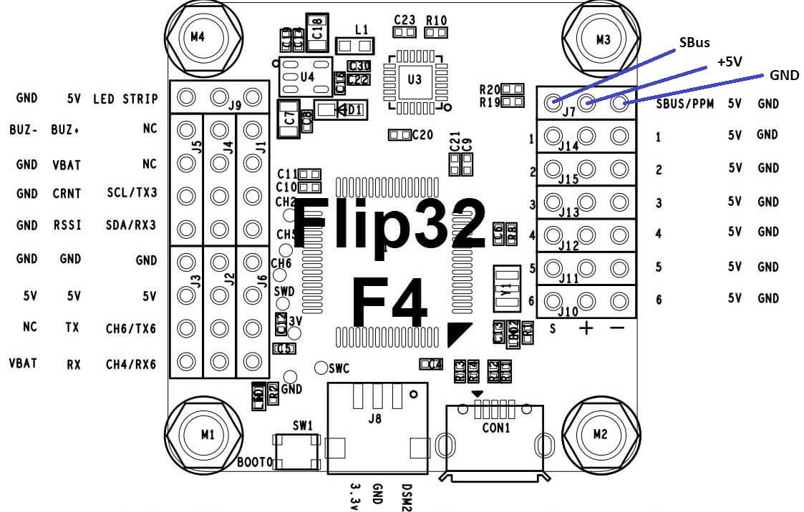
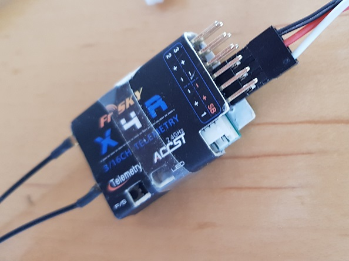

# Receiver input - SBus

The CableCam Controller is put between the RC receiver and the motor controller (ESC). The controller acts as a filter of the input provided by the receiver and the output sent to the motor controller.

One supported receiver type is SBus commonly used with Futaba and FrSky.

## Hardware

#### MCU Pins used

| Function | MCU Pin | MCU Function | Connector Pin   | Flip32 F4   |
| -------- | ------- | ------------ | --------------- | ----------- |
| UART3 RX | PA10    | USART1_RX    | MainUSART Pin 4 | SBUS/PPM/J7 |

#### Pinout

## Associated commands

| Command | Allowed values | Description                                                  |
| ------- | -------------- | ------------------------------------------------------------ |
| \$I     |                | Print the current input                                      |
| \$I 1   | 1              | Set the input to SBus                                        |
| \$d s   |                | print the last SBus packet and some statistics for debugging |
| \$i     |                | print the current values received from the SBus              |

## Settings

The first step is to tell the controller which function to use for decoding the receiver input signal, SBus or SumPPM. With \$I 1 it is set to SBus mode and if the receiver is connected and powered (all three pins, SBus, +5V and GND are connected) and the receiver getting values from the RC sender, the CableCam Controller should start to receive valid inputs immediately. To proof that, \$i can be used to print the current input.

This screen shows when the last input was received and the values for each channel. Correct values are something between 200 and 2000.

If the values are all zero, the following checks should be made

- Is the sender linked with the receiver at the moment? The receiver does not output anything as long as it did not receive anything from the RC sender.
- Is the receiver powered?
- Does the \$I command return 1?
- Is the hardware connection correct, receiver to controller?

In case nothing can be found, the debug command \$d s prints out everything about the serial input line, e.g. if packets have been received at all, noise errors,... and the last buffer content. If all is zero, no byte has ever been received.