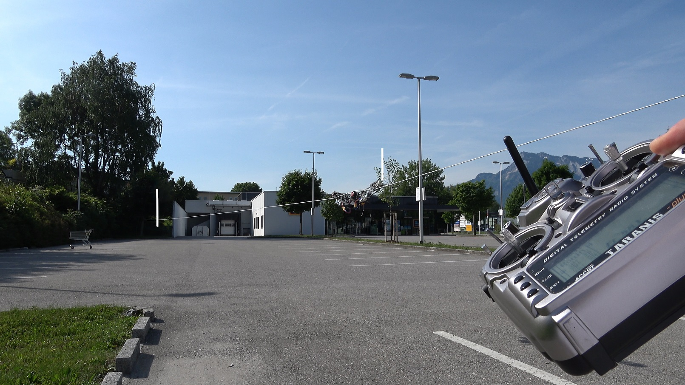

# Play Function

The controller also allows driving between the end points automatically, either by sending the \$P 1 command frequently or using a switch on the TX.

See this [video](https://www.youtube.com/watch?v=D3UhXKbMN38):

This mode is allowed only in strict conditions for:

- End points are set
- Mode is Limiter with Endpoints
- Speed Stick is in neutral
- ESC direction is set (\$r return 1 or -1 but not 0)
- Play was in Off before (else the cablecam might start moving when turning it on)

If one of these preconditions are not met, the controller falls out of the Play mode and Play has to be turned off and on again.

While the Play is running, the acceleration and speed limiters can be modified. 

