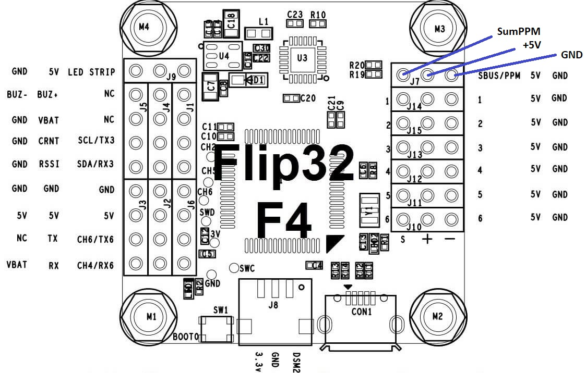

# Receiver input - SumPPM

The CableCam Controller is put between the RC receiver and the motor controller (ESC). The controller acts as a filter of the input provided by the receiver and the output sent to the motor controller.

One supported receiver type is SumPPM commonly found with Graupner receivers and many others.

## Hardware

#### MCU Pins used

| Function | MCU Pin | MCU Function | Connector Pin   | Flip32 F4   |
| -------- | ------- | ------------ | --------------- | ----------- |
| UART3 RX | PA10    | USART1_RX    | MainUSART Pin 4 | SBUS/PPM/J7 |


#### Pinout




## Associated commands

| Command | Allowed values | Description                                |
| ------- | -------------- | ------------------------------------------ |
| \$I     |                | Print the current input                    |
| \$I 0   | 0              | Set the input to SumPPM                    |
| \$d p   |                | print the last SumPPM packet for debugging |
| \$i     |                | print the current values received          |


## Settings

The first step is to tell the controller which function to use for decoding the receiver input signal, SBus or SumPPM. With \$I 0 it is set to SumPPM mode and if the receiver is connected and powered (all three pins, SBus, +5V and GND are connected) and the receiver getting values from the RC sender, the CableCam Controller should start to receive valid inputs immediately. To proof that, \$i can be used to print the current input.

This screen shows when the last input was received and the values for each channel. Correct values are something between 900 and 2100.

If the values are all zero, the following checks should be made

- Is the sender linked with the receiver at the moment? The receiver does not output anything as long as it did not receive anything from the RC sender.
- Is the receiver powered?
- Does the \$I command return 0?
- Is the hardware connection correct, receiver to controller?
- Is it really a SumPPM signal? What does \$d p show?

The debug command \$d p was added to see the current timings. The output might look like

```
Duty & Pause Timing for SumPPM:   
1123   398   1690   398   1123   398   1122   398   7879   401   1122   399   1123   398
1123   399   1123   398   1123   399   1690   398   1122   399   1123   398   7879   401
1122   399   1122   398   1123   399   1123   398   1123   399   1690   399   1122   399
1123   399   7880   401   1123   399   1123   399   1123   398   1124   399   1123   398
1691   399   1123   398   1123   399   7879   401 
```

This shows the time between falling and raising flanks (both). A SumPPM signal consist of a long high phase, indicating the packet end. So reformatting the data with the long pause as last entry proofs this is a valid signal.

Duty & Pause Timing for SumPPM:   
1123   398   1690   398   1123   398   1122   398   **7879**   401
1122   399   1123   398   1123   399   1123   398   1123   399   1690   398   1122   399   1123   398   **7879**   401
1122   399   1122   398   1123   399   1123   398   1123   399   1690   399   1122   399   1123   399   **7880**   401
1123   399   1123   399   1123   398   1124   399   1123   398   1691   399   1123   398   1123   399   **7879**   401 

A SumPPM signal with 8 channels.

Another example could look like:

```
Duty & Pause Timing for SumPPM:   1097   18879   1098   18880   1097   18881   1098   18880...
```

This is clearly a regular servo (single channel) only. It is a puls width of 1097 followed by a looong pause. The receiver does not output a SumPPM signal obviously.

A normal \$i output would look like this:

