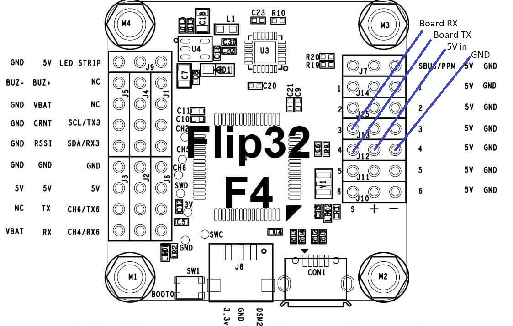
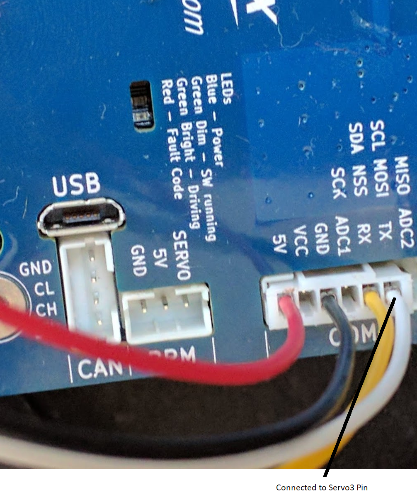

# VESC6 as Motor Controller

An ESC supporting Closed Loop speed operations is the [VESC6](http://www.trampaboards.com/vesc-6-in-cnc-t6-sealed-of-aluminum-box--vedder-electronic-speed-controller-trampa-exclusive-x1-p-23866.html). The price of 330EUR is steep though.

However the VESC6 allows much more than just controlling the speed. As it is connected via UART, the speed can be set precisely, the status of the motor controller can be read etc.

## Hardware

#### MCU Pins used

| Function | MCU Pin | MCU Function | Connector Pin        | Flip32 F4  |
| -------- | ------- | ------------ | -------------------- | ---------- |
| UART TX  | PA2     | USART2_TX    | FlexiPort/Conn1 Pin3 | J1 SCL/TX3 |
| UART RX  | PA3     | USART2_RX    | FlexiPort/Conn1 Pin4 | J1 SDA/RX3 |
| GND      |         |              | FlexiPort/Conn1 Pin1 | J6 GND     |
| 5V       |         |              | FlexiPort/Conn1 Pin2 | J6 +5V     |

#### Pinout

In order to take full advantage of the VESC, the CableCam controller talks to it via UART instead of PPM signals. This allows for more fine grained control.
To connect the VESC with the CableCam Controller, Servo Out 3 is configured as UART RX - connected to VESC TX pin - and Servo Out 4 as TX - connected with VESC RX pin.

As with the RC ESC, the VESC powers the CableCam Controller board via the +5V and GND of the VESC connected to one of the Servo's +5V and GND pins.

_Note: Power the CableCam Controller via +5V and **not the Vcc pin**. The latter might be a too high voltage_

## Associated commands

| Command           | Allowed values                               | Description                                                  |
| ----------------- | -------------------------------------------- | ------------------------------------------------------------ |
| \$e               |                                              | Print the maximum eRPMs configured                           |
| \$e \<max erpms\> | same as the VESC6 setting (Speed Controller) | At 100% speed, the VESC will be asked to run at that speed. Hence this value should not be larger than what was configured in the VESC. |
| $E                |                                              | Print the current status of the VESC6, current speed, duty, amps, battery voltage,... |

## Setup

The VESC has to be configured to use its speed PID controller.