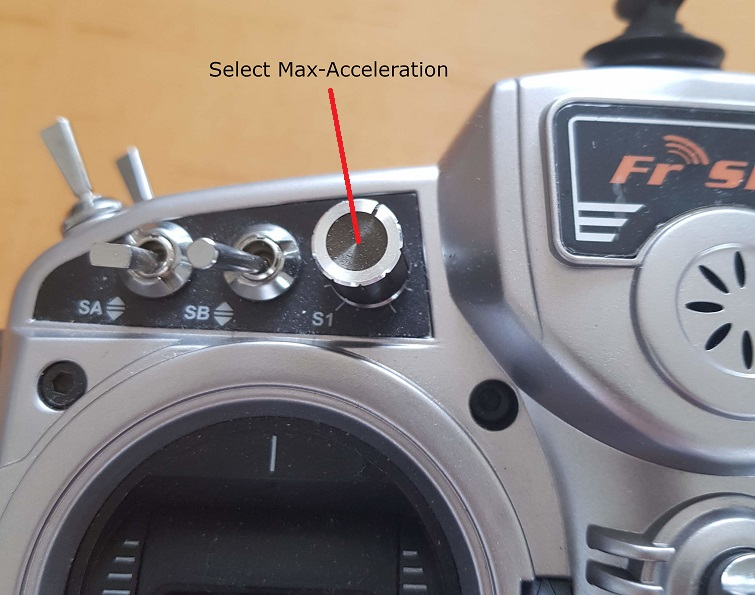

# Limiters

When driving an RC car, applying full thrust instantly is fun, as the wheels start spinning, dirt flying through the air. For the CableCam not so much. Here, a constant acceleration is more important. Therefore the CableCam Controller has in ramp built in.
As long as the user stays within the acceleration limit, he has full control. But if he exceeds the acceleration by e.g. pushing the stick forward too quickly, the stick movement is limited to the maximum allowed acceleration. So the acceleration limiter works by using the stick raw position, e.g. 50%, then apply the expo factor and that is the desired speed in percent. This speed-change is governed by the acceleration limiter.
The speed limiter works on the output. If the max speed is limited to 50%, the the VESC max erpm or the servo output signal is only 50% of what it has been configured as absolute max via _$e_ or _$N_. In other words, 100% throttle would create a 50% output signal only in this example.

### 

## Associated commands

| Command                     | Allowed values      | Description                            |
| --------------------------- | ------------------- | -------------------------------------- |
| \$a                         |                     | Print the current acceleration limiter |
| \$a \<decimal\> \<decimal\> | \>=0.001 and \<=1.0 | Set the acceleration limiter           |
| \$v                         |                     | print the current speed limiter        |
| \$v \<decimal\> \<decimal\> | \>=0.1 and \<=1.0   | Set the speed limiter                  |

When programming the end points, the cablecam should move slower probably. Therefore both commands require two parameters. First the value for the normal movement, second for endpoint programming.

## Settings

### Preconditions

The limiters are applied only in case the current mode (\$m or the TX switch - if configured) is not Passthrough. 

And, as said above, there are two limits. During EndpointProgramming the second parameter applies, else the first parameter.

### Speed Limiter

In order to drive with a constant speed or to limit the speed to prevent accidents, the output signal can be limited. A speed limiter of 50% would mean putting the stick at full forward, creates an output signal of 50% at max. So the servo signal would be (assuming \$N 1500 0 700) limited to +-350us (pulslength 1150us to 1850us), the VESC (assuming a max speed of \$e 50000) would get speed commands up to +-25000eRPMs.

If a dial on the TX is assigned to act as a speed limiter, then the configured value (via \$v) can be changed between 0.1 and this value. See the [RC Input Channels](Step 4 - Assigning Input Channels.md). 

In other words, the \$v value acts as the absolute maximum and the dial can be used to reduce that for the moment.

### Acceleration Limiter

For an even acceleration and hence professional looking shots, the acceleration limiter is used. Its value tells how much [percent] the stick can change per second. A value of 0.1 for example limits the change to 10% per second, in other words, it takes 10 seconds (= 1/0.1) from rest to 100%. And vice versa. The setting works on acceleration and deceleration identically.

As with the speed limiter, the acceleration limiter can be set via a command, \$a in this case, and the dial on the TX - if configured - can be used to select an acceleration limit up to this value.

