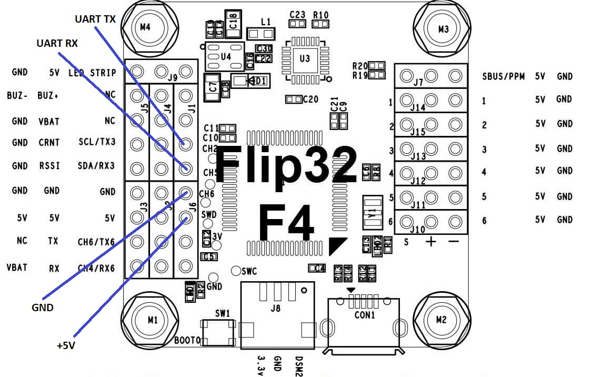
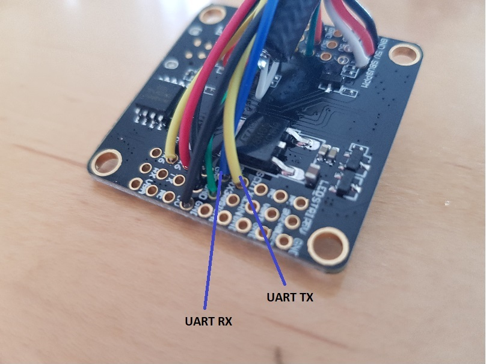
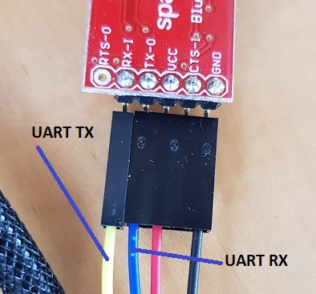

# Bluetooth/UART control

The controller supports getting commands via UART as well, usually connected to a bluetooth receiver like the HC-06. With that it is possible to change settings via an app, monitor the status via a serial bluetooth terminal, change settings on the spot.

## Hardware

#### MCU Pins used

| Function | MCU Pin | MCU Function | Connector Pin        | Flip32 F4  |
| -------- | ------- | ------------ | -------------------- | ---------- |
| UART TX  | PB10    | USART3_TX    | FlexiPort/Conn1 Pin3 | J1 SCL/TX3 |
| UART RX  | PB11    | USART3_RX    | FlexiPort/Conn1 Pin4 | J1 SDA/RX3 |
| GND      |         |              | FlexiPort/Conn1 Pin1 | J6 GND     |
| Vcc      |         |              | FlexiPort/Conn1 Pin2 | J6 +5V     |

#### Pinout

## Associated commands

| Command | Allowed values | Description                                                  |
| ------- | -------------- | ------------------------------------------------------------ |
| \$B     |                | Run the HC-06 configuration wizard. Works with HC-06 bluetooth modules only. |
| $d b    |                | Turn on/off bluetooth debugging. Turned on means that all commands received from bluetooth are also printed on the USB terminal. |
| $d B    |                | Show the last errorcode for the UART3 where bluetooth is connected. Should help if the baud rate or related settings are configured wrong |

## Settings

The UART port is configured for 38400 8n1 and the bluetooth module needs to match that setting. How to change the settings is dependent on the bluetooth module being used.

The shown [Sparkfun Bluetooth Mate Gold](https://www.sparkfun.com/products/12580) is very convenient, it allows configuration of the UART port via the connected bluetooth device.

The more populare HC-06 module can be configured by AT commands. The HC-05 has an additional KEY Pin that needs to be dealt with. Details can be found in many places, e.g. [here](http://www.instructables.com/id/AT-command-mode-of-HC-05-Bluetooth-module/). As the HC-06 is so popular, the CableCam Controller has a command \$B that does configure it automatically via the USB terminal. Connect it to the board, make sure your tablet/computer is not connected with the HC-06 at the moment, because then it accepts AT commands from the UART side. The \$B command sends AT commands at various baud rates and when it gets a valid response, it executes the commands to make some changes. The command outputs the details about what it does.

On the tablet an app proven to work well is the [Serial Bluetooth Terminal](https://play.google.com/store/apps/details?id=de.kai_morich.serial_bluetooth_terminal).

## Which Bluetooth Module to use?

The majority of the bluetooth modules are Class 2 with a range of up to 10m. Not much for a cablecam. The [Sparkfun Mate Gold](https://www.sparkfun.com/products/12580) is one of the few Class 1 devices and has a supposed range of 100m.