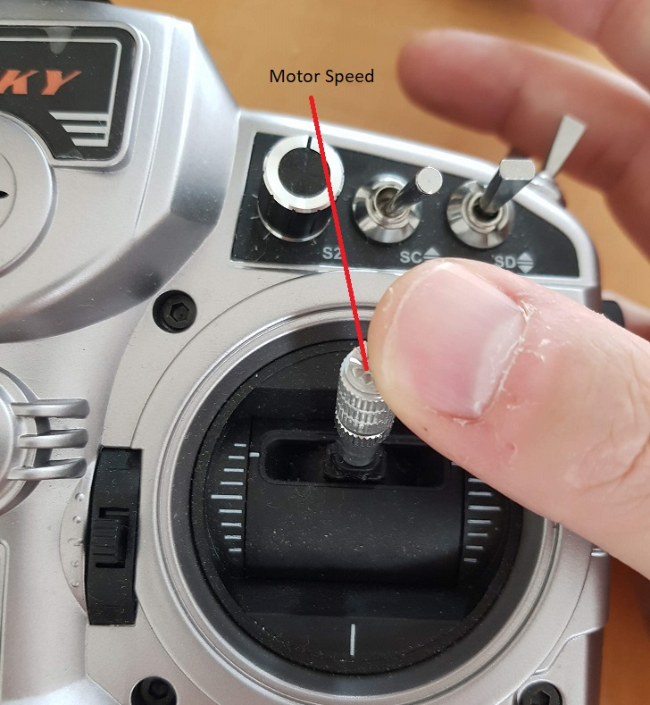
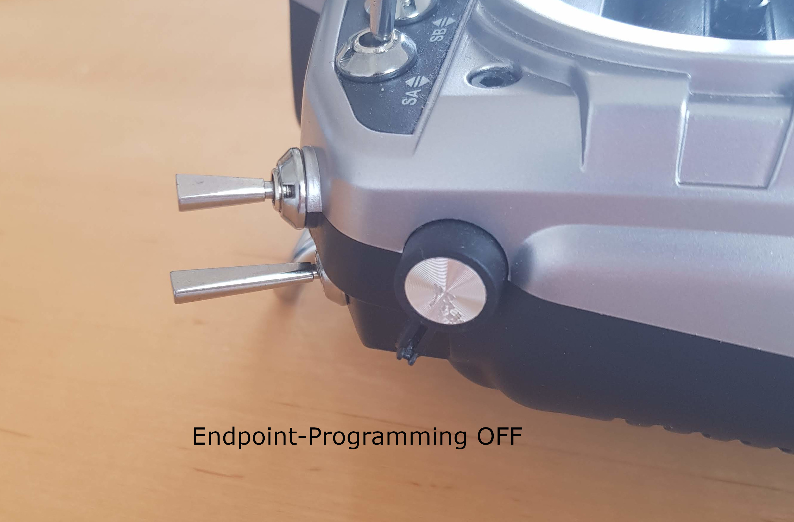
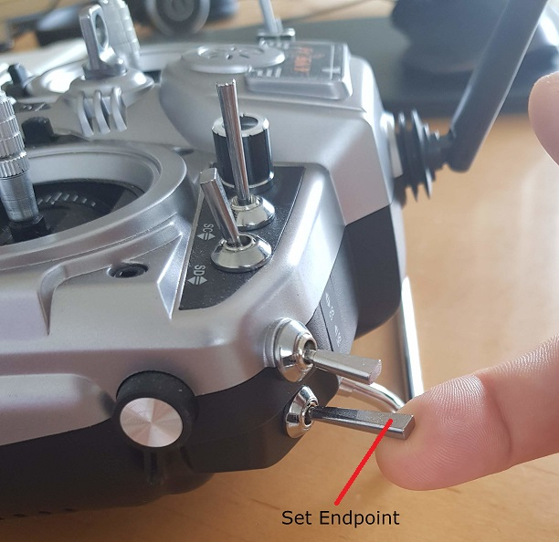
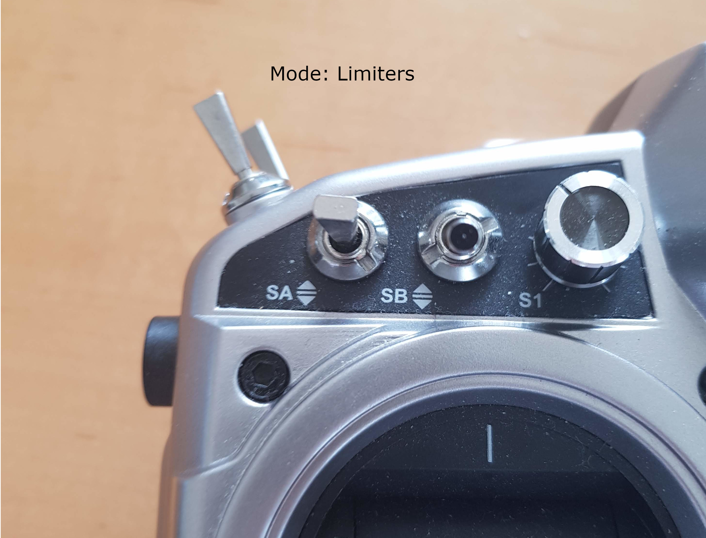
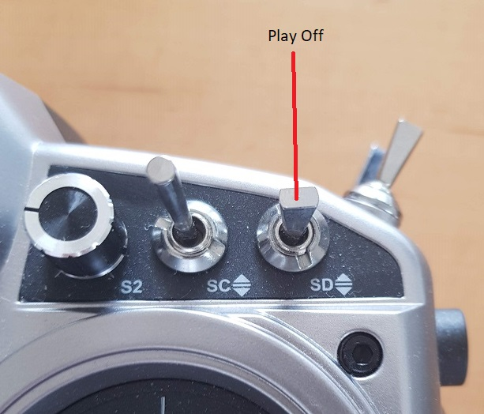

# Assigning Input Channels

The most important functions and settings should be controlled via the RC sender. As the sender can be programmed freely and functions should be assigned to match the personal preferences, this assignment is totally flexible.

Hence the first step will be to decide what functions to use and program the RC sender accordingly.

In this example, it is an **example** only(!), the RC sender has been programmed like this:

 

| Function                                                     | Example Channel# | Description                                                  |
| ------------------------------------------------------------ | ---------------- | ------------------------------------------------------------ |
| **ESC**                       | 8                | Controls the CableCam speed                                  |
| **Prog**  | 11               | Endpoint Programming switch, flip to change from OPERATIONAL to ENDPOINT PROGRAMMING |
| **EndPoint**       | 12               | A tip switch, when touched sets the current position as start/end point |
| **MaxAccel**        | 9                | A dial that allows changing the maximum acceleration         |
| **MaxSpeed**        | 10               | A dial that sets the max speed at stick 100%                 |
| **CCMode**     | 14               | A three-way switch to change between Passthrough, Limiter and Enpoint-with-limiters operation mode |
| **Play**                   | 13               | Allows the controller to move the cablecam between the end points automatically |
| **Aux**                                                      |                  | Servo #2 output can be controlled via a channel as well      |
| **Gimbal**                                                   | 1 to 7           | Channels to control the gimbal                               |

## Associated commands

| Command                                              | Allowed values                                               | Description                                       |
| ---------------------------------------------------- | ------------------------------------------------------------ | ------------------------------------------------- |
| \$1                                                  |                                                              | A guided setup                                    |
| \$i                                                  |                                                              | print the current channel assignments             |
| \$i \<ch#1\> \<ch#2\> ...                            | 1-16 or 256                                                  | Set channel assignments                           |
| \$j \<char\>                                         | v..speed m..CCMode P..Endpoint prog switch e..Endpoint set tip switch A..Max accel dial V..Max speed dial a..Aux source p..Play switch | print the channel for a specific function         |
| \$j \<char\> \<ch#\>                                 | above char plus a channel source of 1-16 or 256              | set a source channel to a function, 256 clears it |
| \$n                                                  |                                                              | print the value ranges for the input              |
| \$n \<neutral\> \<neutral range\> \<max deflection\> | neutral: 500-2000 neutral range: 0-100 max deflection: 300-1400 | set the value ranges for the input channels       |
| \$x                                                  |                                                              | print the expo factor                             |
| \$x \<decimal\>                                      | \>0.0 and \<=1.0, default: 0.1                               | set the expo factor                               |

## Guided Setup

The most convenient method to setup everything is using the \$1 command. It reads the receiver input, sets the neutral point, range and max deflection and asks to change the input by using the sender, e.g. moving the speed stick to assign the channel to the speed function.

See <a href="https://youtu.be/UbZSGKW4F94">this video (here)</a> to get the idea.

This guided setup can be repeated many times until all desired channels are assigned to the various functions. (Or the manual setup can be used for all/for the missing functions)

Once the channels are assigned, it is probably a good idea to store all settings permanently using the \$w command.

## Manual Setup

With the guided setup above only the most important functions can be assigned. For setting all functions at once \$i is the best command. And to assign source channels to specific functions, the \$j command is meant for.

The \$i command also helps to get a quick overview of the assigned channels.

At the top it shows the information when the last signal was successfully decoded. 

The neutral range in a readable form, here the assumed values being received range from 175 to 1813 with 994 being the neutral point and everything between 964 and 1024 is considered neutral, hence no motor movemement within that range. This obviously has to match the values the receiver does send.

At the bottom the current output values for Servo1 (ESC Out) and Servo2 (Aux Out) are shown.

## Troubleshooting

- The \$i command shows zero values for all input channels.
  - This says that no valid signals are received. Reasons we have encoutered were
    1. The RC sender is not turned on or not bound to the receiver. The FrSky receiver does not return any output under these conditions, not even the default values it outputs when the connection has been lost.
    2. The input type is wrong. See \$I for SumPPM versus SBus.
    3. The receiver is not connected properly. Check if the receiver signal goes into the proper pin on the board, the receiver is connected via GND with the board and the receiver is powered.
  - For debugging, the pages for [SumPPM](Step 3b - Receiver Input SumPPM.md) and [SBus](Step 3a - Receiver Input SBus.md) have some methods described.
- The guided setup complains that more than one channel has been moved.
  - When moving a stick in one direction, of course it will wiggle a bit into the other direction as well. Therefore this error means that the other channel moved a lot. If the TX has a screen where the exact channel outputs are shown, this might proof that there is a misconfiguration in the sender, usually a mixer is active still.
- One of the switches is not recognized.
  - The TX has much more controls than available channels, therefore the most need to be assigned in the TX before they can be used.

