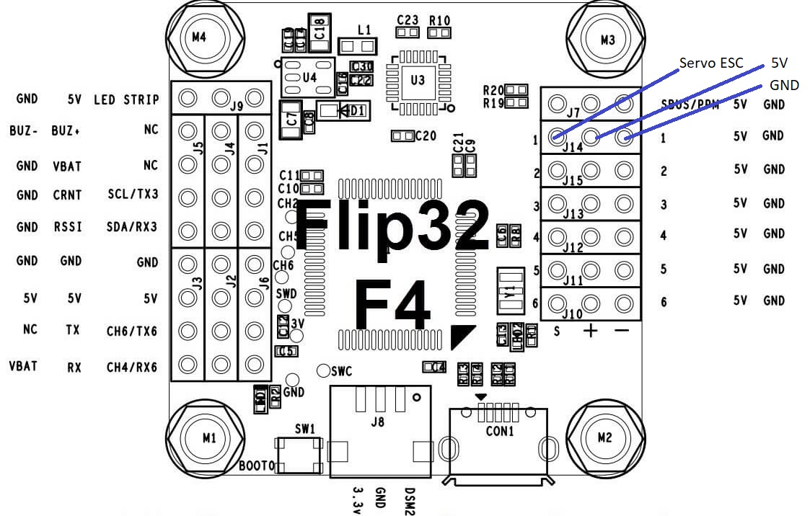
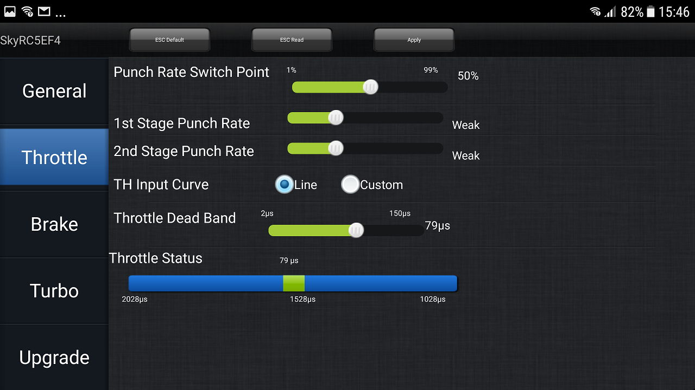

# Using a regular ESC

The project started with regular ESCs as found in 1:8th scale buggies, rock crawlers to be more precise. These provide a lot of power for a decent amount of money but cannot be controlled as directly. The result is good but not perfect.

The minimum requirements for an ESC to be used are

- Supports Drag Brake - when put in neutral it should brake significantly
- Supports Initial Brake - it should brake even at low speeds, else it rolls down a hill faster and faster
- Supports a Forward/Reverse mode, not something where putting the stick into reverse does brake, once the car stopped in can be driven in reverse.
- Reverse can be 100% of forward
- Reverse and Forward use the same throttle curve
- Sensored motor and ESC

ESCs that are meant for Rock Crawlers usually do support all of the above but with linear throttle curves only.

A cheap ESC I use at the moment is the [SkyRC TS160](http://www.skyrc.com/index.php?route=product/product&product_id=212) for 3s batteries together with a [programming box](http://www.skyrc.com/index.php?route=product/product&product_id=176).

One that looks very promising is the [Hobbywing Xerun AXE](http://www.hobbywing.com/goods.php?id=635), at least once it is available for larger than 1/10th applications.

## Hardware

#### MCU Pins used

| Function | MCU Pin | MCU Function | Connector Pin | Flip32 F4  |
| -------- | ------- | ------------ | ------------- | ---------- |
| Servo1   | PB0     | TIM3_CH3     | Servo1        | J14 Servo1 |

#### Pinout

In most cases the ESC will be used to power the entire CC3D Revo board and therefore the ESCs +6V signal will be connected. The CC3D Revo has power converters and protection circuits, hence the higher voltge is no problem and powering the board from USB and the ESC at the same time is supported as well.

## Associated commands

| Command                                          | Allowed values                         | Description                                                 |
| ------------------------------------------------ | -------------------------------------- | ----------------------------------------------------------- |
| \$N                                              |                                        | print the ESC (neutral) values                              |
| \$N \<neutral\> \<neutral range\> \<deflection\> |                                        | set the ESC (neutral) values, should match the ESC settings |
| \$g                                              |                                        | print max position error                                    |
| \$g \<decimal\>                                  | \>0.0; 100.0 will be a good value | set the max position error                                  |
| \$i                                              |                                        | shows at the bottom the generated Servo1 output signal      |

## Setup

The Servo1 does always generate an output signal based on the desired speed. However, as the input does use a different value range than the output, it needs to be configured separately using the \$N command.

The ESC might have a setting like this:

The Throttle Status shows that values from 1028us to 2028us are allowed and a range of 79us around the midpoint of 1528us is considered Neutral. 

These settings have to match the \$N settings, so should be for this example: \$N 1528 39 461.

| \$N parameters | Values                                     |
| -------------- | ------------------------------------------ |
| Neutral point  | 1528us                                     |
| Neutral range  | 79us/2 = 39us                              |
| Deflection     | 2028-39-1528=461us 1528-39-1028=461us |

Using the \$i command the current values for input and below that, the ESC output are printed. Executng this command while holding the stick at full forward or full reverse can be used to double check the settings.

The max positional error \$g will later be needed for the end points to work with these ESCs. If the CableCam drives at speed and is configured, using the \$a setting, to brake from this speed to a full stop in 10 seconds in order to reach the end point perfectly, what creates that brake signal? The servo1 output will ask the ESC to reduce speed gradually, say 100%, 90%, 80%,....0% in those 10 seconds. Therefore only the drag brake of the ESC is used and it will likely not be strong enough. The ESC would apply a stronger brake force when the servo1 signal is neutral. But that will be too strong and for sure does not correlate with the current (de)acceleration settings. The solution is the \$g value.

The current speed is measured by the position sensor and based on that, the brake distance is calculated. Assuming the brake distance is greater than the distance to the end point, the controller does reduce the speed output, say to 90% throttle. The ESC will use the drag brake to slow down the cablecam a bit, say it slows it down to 95% of the speed. As this is not enough brake power, soon the calculation will show that the end point will be overshot significantly. If that value is more than \$g's positional error, then the controller does ouput a neutral signal instead. Now the ESC will brake as hard as it can until the brake distance is smaller than the \$g max positional error. At this point the controller does switch back to a normal throttle signal, which might have beed reduced to 50% throttle meanwhile.

## More details

At first sight the CableCam is like a RC car. It drives forward, backward and stops. One main difference however is that the CableCam should drive forward and backward in an symmetrical fashion. Many car ESCs do not support that. With those you can accelerate the car forward, putting the stick in neutral lets the car free wheeling and to brake it actively, the stick has to be put into reverse until it stops. And only then you can go in reverse direction, probably at reduced speed.
With the CableCam we want something else. Putting the stick forward drives the CableCam in one direction, neutral means stopping and reverse means driving in reverse direction at same speed as forward.
The drag brake level means how decisive the car brakes when the stick is in neutral while moving. A drag brake of zero would let the car continue to drive, slowed down only by resistance. A high drag brake means the ESC does use regenerative braking and removes kinetic energy from the car, thus stopping it more quickly.
The initial brake level controls if the motor should be energized a little bit when the car is at a stand still, thus locking it to the current position.
Unfortunately even the higest brake level settings are too weak for the CableCam to work in all instances. Most noticable when the CableCam should drive up and down a hill. Without an initial brake, it would start rolling downhill faster and faster. Thanks to the initial and drag brake it brakes but is still rolling downhill, just slower.

The best ESC would be one that supports a Closed Loop Speed control. Because then the stick position controls the speed instead of the thrust. With such an ESC a stick position of neutral would make the CableCam hold the current position, preventing it from rolling downhill at all. 
Such ESCs are quite common in industrial applications like robotics or CNC servo motors but they are also quite expensive and not meant for cars and RC implementations. So they do not have an UART input but RS232. They are quite heavy or conveniently small but support tiny motors only. Unfortunately I have not managed to convince any of the RC car ESC vendors to add a close loop mode although it would be a piece of cake for them. The hardware supports it and the logic is well known.

## Troubleshooting

One problem the CableCam controller has is, it sits between two systems and hence has to know both. The software tries to automate as much as possible but without feedback, many things are not possible. So much for the excuses. If you have ideas, please write up issues here in github.
In case you have issues, please post an [issue](https://github.com/wernerdaehn/CC3D-CableCam-Controller/issues).

* The motor does not start although everything has been configured. 

One reason the motor does not start is when the stick is not in neutral at startup. This is a safety precaution, nobody wants the CableCam or RC car to drive away at high speed right after turing it on. And this precaution is implemented in the CableCam Controller and in the ESC, both! Hence the first thing to check is the neutral point of the input. Using _$i_ the current value of the speed channel can be checked. Hence the neutral point should use this value, see the command _$n_.
With above controller allows to change the output signal from neutral do something else. Which does not help much in case this output signal for neutral is not neutral for the ESC, because then it would not allow to move the motor. The default neutral point of the ESC output is 1500, which is standard. The _$N_ command allows to change that however. The _$i_ command prints out the ESC output signal as well, which might come in handy to proof the servo signal for the ESC does change at different stick positions.

* There is a long delay when moving the stick until the motor starts

This is likely a combination of the acceleration limit and the ESC output neutral range _$N_.
To visualize this, imagine the following situation:

The neutral range of the CableCam Controller is way smaller (30us) than the range the ESC is actually using (50us). So it takes a bit until the stick is moved enough for the ESC to start moving the motor. How long depends on the amount - that will not be much - but also on the max accel setting _$a_. If it takes 1 second for the output signal to reach the +50, there is a delay of 1 second. Second, a signal of 1551 does not mean the cablecam moves. It might not be enough thrust to overcome the resistence yet. Having said that, with the configured defaults and the allowed value ranges, this should not be a huge delay.

* No slow speeds possible

Obviously the ESC itself has a minimum speed. The only reason why the cablecam controller might not be able to go equally slow is again an effect around the output neutral range _$N_. If the CableCam Controller has a larger neutral range than the ESC. Then the first output signal will be will outside the ESC's neutral range. Solution is to reduce the neutral range, e.g. _$N 1500 20 700_. Or better to the exact values as shown above.

* Forward and reverse is different

Another variation of the neutral settings, this time the neutral point is not aligned. If the center of the controller is 1500 but for the ESC it is 1520, the stick moves outside the neutral range of the ESC in one direction much faster and slower in the other.
Solution is to align the neutral point. The probably best way for that is to calibrate the ESC. You would put the controller in passtrough mode _$p 1_ and therefor the input signal is sent to the output unfiltered. No end point, no speed or accel limit is used. Now perform the ESC calibration. In case of the TS120/160 that means turning on the ESC and keeping the power button pressed until the motor does peep. Stick in neutral and press the power button on the ESC once to set the neutral point - one beep; put the stick full forward and press the button again - two beeps; put the stick in full reverse and press the button a lst time - three beeps - and the ESC is calibrated.

