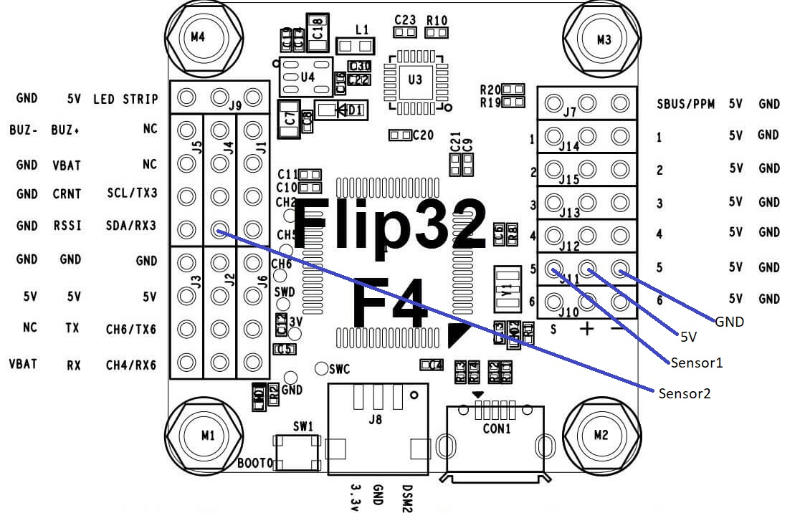
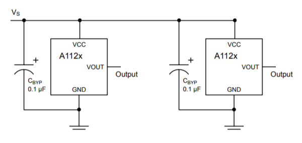

# Position Sensor

To know the actual position and speed of the CableCam, on one of the running wheels a position sensor is placed. This can be anything that has two output signals and can be connected to a Quadrature Encoder.

## Hardware

#### MCU Pins used

| Function | MCU Pin | MCU Function | Connector Pin | Flip32 F4  |
| -------- | ------- | ------------ | ------------- | ---------- |
| Servo5   | PA0     | TIM5_CH1     | Servo5        | J11/Servo5 |
| Servo6   | PA1     | TIM5_CH2     | Servo6        | J4 RSSI    |
| GND      |         |              | Servo5        | Servo5     |
| Vcc      |         |              | Servo5        | Servo5     |

Note: Yes, on the Flip32 the MCU pin PA1 is not connected to Servo6 but to RSSI!

#### Pinout

## Associated commands

| Command | Allowed values | Description                                                  |
| ------- | -------------- | ------------------------------------------------------------ |
| \$p     |                | prints the start point, end point, current position according to the counter and current speed |

## Settings

The hall sensor is very simple. The [Allegro Microsystems A1120](http://www.allegromicro.com/en/Products/Magnetic-Digital-Position-Sensor-ICs/Hall-Effect-Unipolar-Switches/A1120-1-2-5.aspx) sensor connects the output to Gnd if the magnetic field perpenticular to the chip surface exceeds a certain level and opens that switch if it falls below a level (=Open Drain). These two levels are different, hence avoiding noise in case the magnet field is exactly at the switch level (=Hysteresis). As a result, the sensor board can be very simple. Power between 3..24V is provided - hence perfectly suited for the Vcc_unreg provided by the ESC - and a capacitor nearby the chips is needed. The output signal of both is connected directly to the Servo5&6. A pullup resistor is not needed either, the STM32 MCU internal ones are turned on for those two pins.

The only important things to make sure are

1. The hall sensor does switch on and off reliably, meaning the magnetic field has to raise above and fall below the thresholds for sure.
2. The two hall sensors have a delay between switching on/off as this delay tells the rotation direction. If both would switch on exactly the same time, no rotation direction can be derived.

To achieve that, one of the running wheels has 22 bores of d3x8mm (3mm drill and 8mm deep) and magnets are inserted alternating north/south. The hall sensor does switch on north magnetic fields only and therefore by adding a south orientated magnet between, it is an absolute certainty, the north field strength falls below the required level. 
In my case the bores are drilled into the skate wheel with a diameter of 60mm, hence the distance between each drill is 8.6mm. So as long as the distance between the two hall sensors is not 17.2mm or multiples thereof, they will not switch on/off at the same time. I aimed for a distance of 8.6mm+50% = 13mm roughly.

_Note: The sensor board PCB is currently redesigned using above guidelines. Maybe LEDs will be added as well as visual indication?_

To test if all is working, the sensor board needs to be powered and then moving the wheel should change the third output value of the \$p command, the current position.