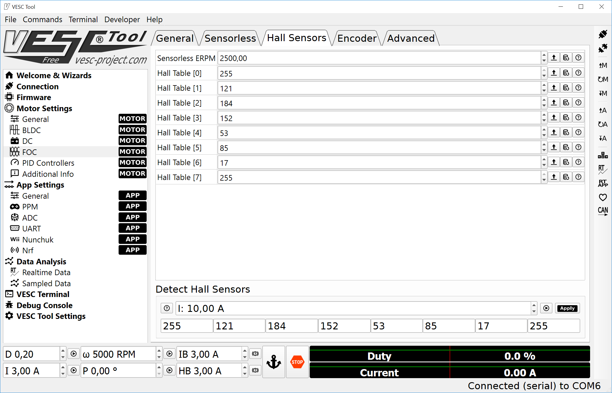
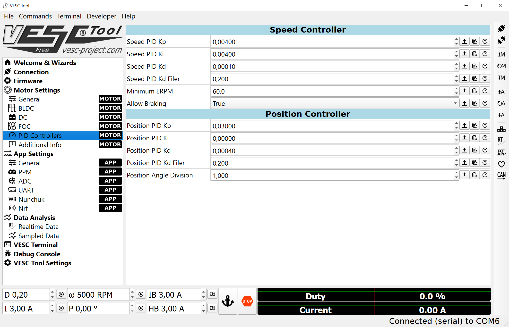
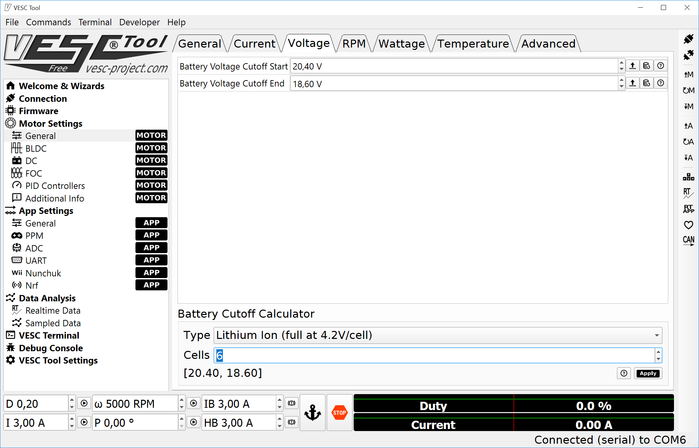
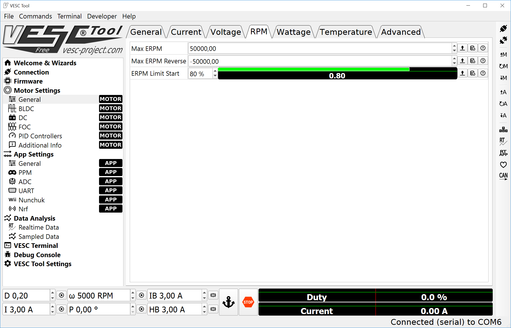
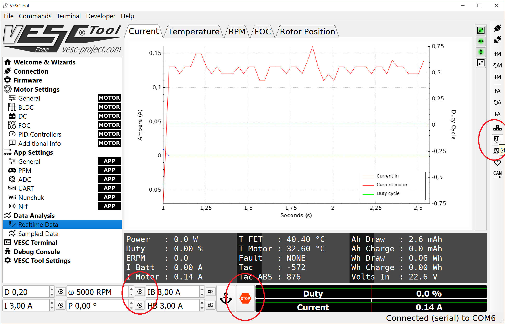
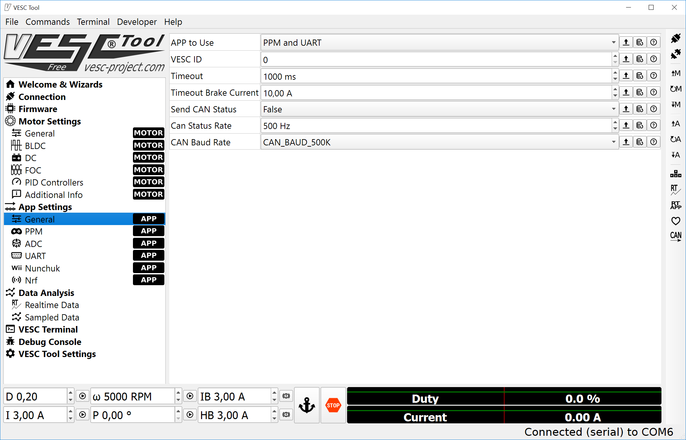

# VESC6 Configuration

To help with the VESC configuration, the steps tp configure it for the CableCam use - after firmware update - are described here.

## Basics about a brushless motor controller

A brushless motor is essentially maintenance free, strong and simple to use. In the industry they are found everywhere. They consist of three power connectors and by applying power to two of them, the motor's next magnet ist pulled to the powered winding. Then the next winding is powered etc.

This technique opens two questions

1. Where is the motor at the moment? Else it is unknown which winding to power.
2. How much power to apply?

There are multiple strategies for that and the more sophistication is but into those two factors, the better the motor will operate.

Two terms are important here: [FOC](https://en.wikipedia.org/wiki/Vector_control_(motor)) and Encoder.

## Setup procedure

It is assumed that the Vesc controller and the motor are connected, the motor is using Hall sensors, all is powered up, the VESC is of latest firmware and the Vesc Tool connected.

#### Step 1 - FOC values

In the FOC screen of the motor settings a few parameters need to be entered. The only setting known at this point is the sensor mode - it should use Hall Sensors. Luckily the other parameters the Vesc can measure itself. 

At the bottom is the "Detect and Calculate Parameters" sequence of buttons, which starts with a short help and pressing one button after the other triggers the various measurements. Once RL and λ are created, the last button - Apply - copies the values to the top settings. On the right hand side is a button to write these settings to the Vesc permanently.

#### Step 2 - Hall Sensor

The three Hall sensors do switch on and off at particular angles of the motor. One full sequence has six positions and is divided into values from 0 to 200. While normal ESCs require to connect the three motor phases and the three Hall sensors in a particular order, the Vesc does rather measure the positions.

At the bottom "Detect Hall Sensors" is a Play button which turns the motor with the configured 10A power. With Apply the values are copied to the top. First and last values are irrelevant (255 always).

As this is measured the values might be different by a few percent per run which is just fine.

#### Step 3 - PID control loop

The main advantage of the Vesc is its speed controller, also called Closed Loop. A target rpm value is sent to the Vesc and it will do whatever is necessary to get to this speed and keep it. Driving uphill, rolling downhill and braking,.... the Speed Controller logic takes care of that.

Setting the right values can be quite difficult but the defaults should be good enough. At the very bottom left is a "ω 5000 RPM" and its Play button. This allows to test the speed controller.

Two values are important here however. First is the Minimum ERPM" as at the current implementation does not work for low speeds. Every RPM command below this threshold stops the motor. And to allow active braking.

#### Step 4 - Voltage Cutoff

To protect the battery the Vesc will turn off if the voltage falls below a certain value. Hence this needs to be configured. Simplest way is to choose the battery type and the number of cells - here LiPo with 6s (or more precise, 2x 3s LiPos in series) - and Apply copies the values.

#### Step 5 - RPM Limit

The Vesc also has a ERPM limit for forward and reverse. Thsi should match with the motor specs or be lower than that. This value should also be at least as high as the \$e command shows. It does not make sense to put the stick into 100% forward, that translates to a Vesc speed command of e.g. 50'000ERPMs (the \$e value) but the motor is limited to less than that, does it?

#### Step 6 - Saving all to the Vesc and testing

If not done already, the motor settings should be saved to the Vesc using the right hand button list to save the configuration of the motor values.

Also there is a RT botton to start reading the values from the controller and displaying it in the Data Analysis -> Realtime Data graph. 

The controller supports different type of commands: Duty, Amps, Speed, Initial Brake, Handbrake. The P command is for moving the motor to a certain angle which is useful for a servo-like application only. It is not(!) a positional control in the sense of "drive 10 meters forward".

#### Step 7 - Input settings

The Vesc accepts commands from various sources, a servo signal, UART and other input devices. The CableCam controller can output a PPM servo signal but it is much better to control the Vesc directly via UART, hence this should be enabled as "APP to Use". 

This allows more accurate control as the target ERPM values are sent literally. And it allows to read the status values from the Vesc using the \$E command.

These App Settings have to be saved to the Vesc via the App button.

see [Connecting the Vesc](./Step%205b%20-%20VESC%20as%20motor%20controller.md) for the hardware wiring

